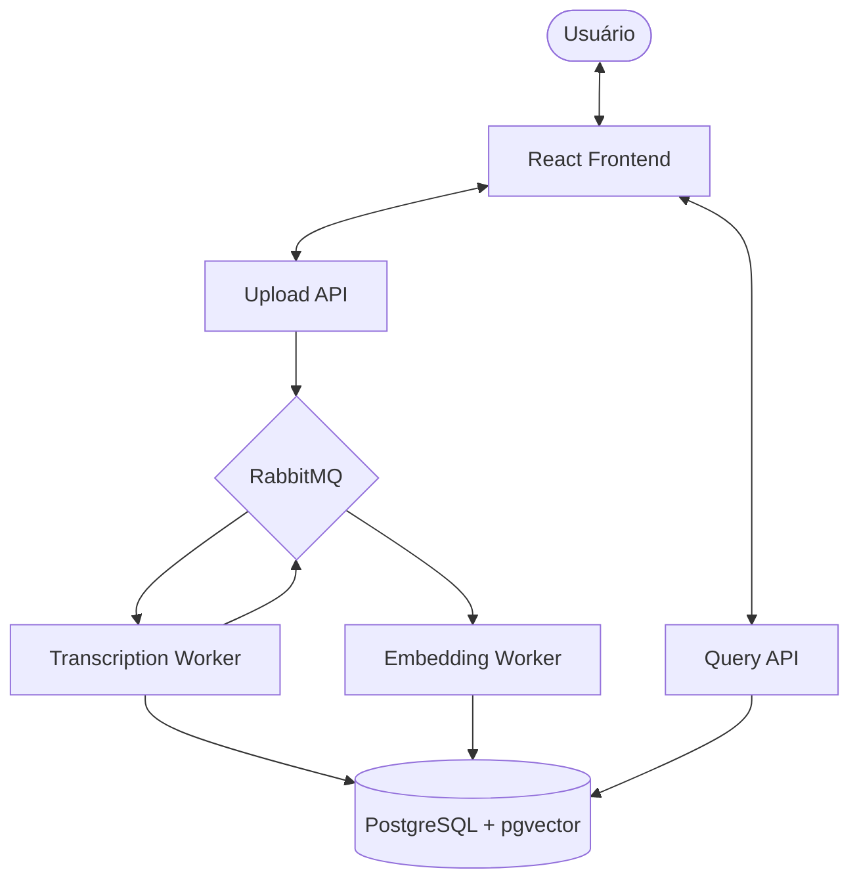

# Media Transcript Knowledge RAG (Frontend) 🚀

Este é o frontend do sistema de Transcrição, Indexação Semântica e Busca baseada em RAG (Retrieval-Augmented Generation). A aplicação permite o upload de arquivos de mídia, visualização de transcrições e realização de buscas semânticas inteligentes sobre o conteúdo processado.

Acesse o backend da aplicação [Clicando aqui](https://github.com/Brendon3578/MediaTranscriptKnowledgeRAG)

## 📌 Descrição do Projeto

O sistema resolve o problema de busca e recuperação de informações em grandes volumes de conteúdo de áudio e vídeo. Em vez de depender apenas de palavras-chave, o sistema utiliza **IA local (Whisper + Ollama)** para transcrever e gerar embeddings vetoriais, permitindo consultas baseadas no significado do conteúdo.

Esta aplicação web atua como a interface principal para:

- **Gerenciamento de Mídias**: Upload e visualização do status de processamento.
- **Exploração de Conteúdo**: Leitura de transcrições segmentadas com timestamps.
- **Busca Semântica (RAG)**: Interface de chat para fazer perguntas sobre o conteúdo das mídias, com respostas geradas por LLM baseadas no contexto recuperado.

---

## 🏗 Arquitetura da Solução

O ecossistema é baseado em uma **Arquitetura Orientada a Eventos (EDA)** no backend, enquanto este frontend consome as APIs de forma assíncrona.

### Componentes do Sistema (Visão Geral)

| Serviço | Responsabilidade |
| :--- | :--- |
| **Web App (Este projeto)** | Interface do usuário em React/TS para interação com o sistema. |
| **Upload.Api** | Recebimento de arquivos e publicação de eventos de upload. |
| **Transcription.Worker** | Transcrição via Whisper (processamento em background). |
| **Embedding.Worker** | Geração de vetores via Ollama/pgvector. |
| **Query.Api** | Motor de busca semântica e orquestração RAG. |

---

## 🔄 Fluxo de Trabalho

1. **Upload**: O usuário envia um arquivo de mídia via interface.
2. **Processamento**: O backend transcreve o áudio e gera embeddings para cada segmento.
3. **Indexação**: Os dados são salvos no PostgreSQL com suporte a busca vetorial (pgvector).
4. **Consulta**: O usuário faz uma pergunta na interface de busca.
5. **Recuperação**: O sistema busca os trechos mais relevantes semanticamente.
6. **Resposta**: Uma LLM gera uma resposta contextualizada baseada nos trechos encontrados.

---

## 🚀 Tecnologias Utilizadas

- **Frontend**: React 18 + TypeScript
- **Build Tool**: Vite
- **Estilização**: Tailwind CSS
- **Componentes**: Shadcn UI
- **Gerenciamento de Estado/Queries**: TanStack Query (React Query)
- **Roteamento**: React Router
- **Ícones**: Lucide React

---

## 🧠 Fluxo de RAG (Busca Semântica)

A interface de busca permite interagir com o conhecimento extraído das mídias:

- **Busca Vetorial**: A consulta do usuário é convertida em um vetor e comparada com os segmentos no banco.
- **Contexto Temporal**: Os resultados mostram exatamente em que momento da mídia a informação foi mencionada.
- **Geração de Resposta**: O sistema utiliza o contexto recuperado para responder perguntas específicas, evitando alucinações da IA.

---

## 🏗 Diagrama de Arquitetura



---

## 🛠 Como Executar o Projeto

### Pré-requisitos

- **Node.js** (v18 ou superior)
- **npm** ou **yarn**
- **Backend rodando**: Este frontend depende das APIs de Upload e Query.

### Instalação

1. Clone o repositório:

```bash
git clone https://github.com/brendon3578/media-transcript-knowledge-web.git
```

1. Instale as dependências:

```bash
npm install
```

1. Configure as variáveis de ambiente, criando um arquivo `.env.development`:

```env
VITE_QUERY_API_URL=https://localhost:7032
VITE_UPLOAD_API_URL=https://localhost:7290
```

1. Inicie o servidor de desenvolvimento:

```bash
npm run dev
```

---

## 📈 Status do Projeto

### ✅ Funcionalidades Implementadas

- [x] Interface de Upload de Mídias.
- [x] Listagem de Biblioteca de Mídias.
- [x] Visualização de Transcrições com Timestamps.
- [x] Interface de Chat para Busca Semântica (RAG).
- [x] Seleção dinâmica de modelos de transcrição.

### 🚀 Próximos Passos (Roadmap)

- [ ] Resumo automático de mídias.
- [ ] Análise de sentimento dos diálogos.
- [ ] Suporte a múltiplos idiomas na interface.
- [ ] Exportação de transcrições em PDF/SRT.
- [ ] Acompanhamento da Transcrição em tempo real via web socket ou similar
